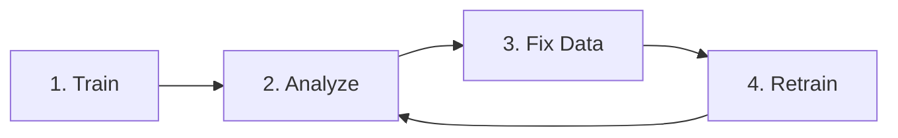

# 🐕🧁 Chihuahua vs Muffin Classification - Starter Kit

[](https://3lc.ai)
[](LICENSE)

> **3LC x AWS Cloud @ UT Dallas Hackathon**  
> Can you tell them apart? Build an image classifier using data-centric AI!

---

## 🎯 Quick Start

### 1. Setup Environment

```bash
# Clone and navigate
git clone <repo-url>
cd 3lc-chihuahua-muffin-starter

# Create environment
python -m venv 3lc-env
source 3lc-env/bin/activate  # Windows: 3lc-env\Scripts\activate

# Install 3LC (includes PyTorch, torchvision, and dependencies)
pip install 3lc
pip install joblib pacmap
```

### 2. Login to 3LC

```bash
# Create account at https://account.3lc.ai
# Get API key from https://account.3lc.ai/api-key
3lc login <your_api_key>

# Start Dashboard (optional but recommended)
3lc service
```

### 3. Download Dataset

#### Install AWS CLI (if not already installed)

**Windows:**
1. Download: [AWS CLI Installer](https://awscli.amazonaws.com/AWSCLIV2.msi)
2. Run the installer with default settings
3. **Close and reopen your terminal** after installation

**Mac:**
```bash
brew install awscli
```

**Linux:**
```bash
# Ubuntu/Debian
sudo apt install awscli

# RHEL/CentOS
sudo yum install aws-cli
```

#### Download the Dataset (no AWS account required!)

Navigate to your working directory and run these commands:

```bash
# Windows (PowerShell)
cd path\to\3lc-chihuahua-muffin-starter
aws s3 sync s3://3lc-hackathons/muffin-chihuahua/train128 ./train128 --no-sign-request
aws s3 sync s3://3lc-hackathons/muffin-chihuahua/test128 ./test128 --no-sign-request

# Mac/Linux
cd path/to/3lc-chihuahua-muffin-starter
aws s3 sync s3://3lc-hackathons/muffin-chihuahua/train128 ./train128 --no-sign-request
aws s3 sync s3://3lc-hackathons/muffin-chihuahua/test128 ./test128 --no-sign-request
```

This will download `train128/` and `test128/` directly into your starter kit folder (no intermediate folders).

**Expected structure after download:**
```
3lc-chihuahua-muffin-starter/
├── train128/
│   ├── chihuahua/    (100 images)
│   ├── muffin/       (100 images)
│   └── undefined/    (4,533 unlabeled images)
├── test128/
│   ├── chihuahua/    (640 images)
│   └── muffin/       (544 images)
└── starter_notebook.ipynb
```

### 4. Choose Your Path

#### 🎓 **Interactive Learning (Recommended)**
```bash
jupyter notebook starter_notebook.ipynb
```
Run all cells sequentially. The notebook includes:
- Environment verification
- Dataset registration  
- Model training with ResNet-18
- Metrics collection & analysis
- Step-by-step explanations

#### ⚡ **Quick Experiments**
```bash
python register_tables.py  # Run once to create 3LC tables
python train.py            # Train the model
```

### 5. Analyze & Improve

Open [3LC Dashboard](https://dashboard.3lc.ai) to:
- 🔍 Explore embeddings visualization
- 📊 Analyze per-sample metrics
- ✏️ Fix labels and improve data quality
- 🔄 Create new table versions

---

## 📊 Dataset

| Split | Total | Labeled | Unlabeled |
|-------|-------|---------|-----------|
| **Train** | 4,733 | 200 (100 chihuahua + 100 muffin) | 4,533 undefined |
| **Test** | 1,184 | 1,184 (640 chihuahua + 544 muffin) | 0 |

**The Challenge:** Use only 200 labeled samples + strategic labeling of undefined samples to achieve high accuracy!

---

## 📁 Files

| File | Description |
|------|-------------|
| **`starter_notebook.ipynb`** | 🌟 Complete interactive tutorial |
| **`register_tables.py`** | Register dataset with 3LC (run once) |
| **`train.py`** | Standalone training script |
| **`content/`** | Dashboard screenshots & visual guides |
| **`LICENSE`** | MIT License |
| **`README.md`** | This file |

---

## 🔄 The Data-Centric Workflow



### 1. **Train** 📈
- Run `starter_notebook.ipynb` or `train.py`
- Model collects per-sample metrics automatically

### 2. **Analyze** 🔍  
- Open [Dashboard](https://dashboard.3lc.ai)
- Navigate to the run and investigate it
- Explore embeddings for outliers

### 3. **Fix** ✏️
- Correct mislabeled samples
- Label the unlabelled examples using the embeddings as a guide
- Remove poor-quality samples

### 4. **Retrain** 🔄
- Dashboard creates new table version
- Re-run training (uses `.latest()` automatically)
- Compare runs to measure improvement

**Repeat until you reach target accuracy!**

--- 

### Common Mistakes to Avoid
- ❌ Don't ignore the 4,533 unlabeled samples (huge opportunity!)
- ❌ Don't label randomly (use model feedback to guide you)
- ❌ Don't make too many changes at once (isolate improvements)
- ❌ Don't skip Dashboard analysis (it reveals critical insights)

---

## 🆘 Troubleshooting

<details>
<summary><b>CUDA not available</b></summary>

Training will use CPU (slower but works). For GPU support:
```bash
# CUDA 11.8
pip install torch torchvision --index-url https://download.pytorch.org/whl/cu118

# CUDA 12.1  
pip install torch torchvision --index-url https://download.pytorch.org/whl/cu121
```
Visit [pytorch.org](https://pytorch.org/get-started/locally/) for your CUDA version.
</details>

<details>
<summary><b>3LC Dashboard blank page</b></summary>

- Ensure `3lc service` is running in a terminal
- Try Chrome or Firefox (WebGL required)
- Check browser console for errors
</details>

<details>
<summary><b>Out of Memory (OOM)</b></summary>

Reduce batch size in training config:
```python
BATCH_SIZE = 16  # Try 8 if still OOM
```
</details>

<details>
<summary><b>Jupyter kernel not found</b></summary>

```bash
pip install ipykernel
python -m ipykernel install --user --name=3lc-env
```
Then select `3lc-env` kernel in Jupyter.
</details>

---

## 📚 Resources

### Visual Guides
- **`content/` folder** - Dashboard screenshots and visual walkthroughs
- See what the 3LC Dashboard should look like at each step
- Reference images for embeddings, metrics, and editing workflows

### Documentation
- [3LC Docs](https://docs.3lc.ai) - Complete platform guide
- [3LC Quickstart](https://docs.3lc.ai/3lc/latest/quickstart/quickstart.html) - Get started fast
- [PyTorch Tutorials](https://pytorch.org/tutorials) - Deep learning basics

### 3LC Dashboard
- [Open Dashboard](https://dashboard.3lc.ai)
- [Edit Tables Tutorial](https://docs.3lc.ai/3lc/latest/how-to/basics/edit-table.html)
- [Metrics Collection](https://docs.3lc.ai/3lc/latest/how-to/metrics/collect-metrics.html)

---

## 🏆 What You'll Learn

By completing this challenge:

✅ **Data-Centric AI** - Improving models by improving data  
✅ **Active Learning** - Strategic labeling of unlabeled data  
✅ **Experiment Tracking** - Systematic ML development  
✅ **Production Workflows** - How real teams build AI  
✅ **Deep Learning** - Modern PyTorch & ResNet architecture  

**These skills are what separate great ML engineers from the rest!**

---

## 🤝 Contributing

Found a bug or have a suggestion? Please open an issue or submit a pull request!

---

## 📄 License

This starter kit is provided under the [MIT License](LICENSE).

---

## 🙏 Acknowledgments

**Built for the 3LC x AWS Cloud @ UT Dallas Hackathon**

- **3LC** - Data-centric AI platform and technical support
- **AWS Cloud Club @ UT Dallas** - Event organization
- **University of Texas at Dallas** - Venue and resources

---

## 🚀 Ready to Start?

1. ✅ Complete setup (Steps 1-3 above)
2. ✅ Download dataset and place in root directory
3. ✅ Open `starter_notebook.ipynb` **← START HERE**
4. ✅ Run all cells to train your first model
5. ✅ Open Dashboard to analyze and improve!

**Good luck, and may the best data win!** 🎉

---

*Questions? Check the [3LC Documentation](https://docs.3lc.ai) or ask hackathon organizers.*

